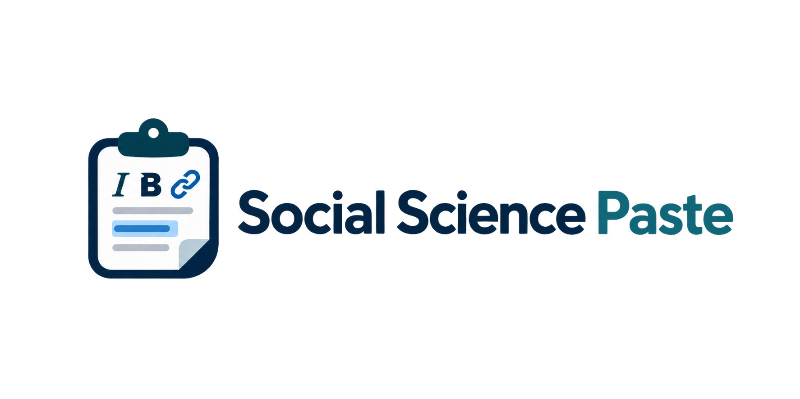
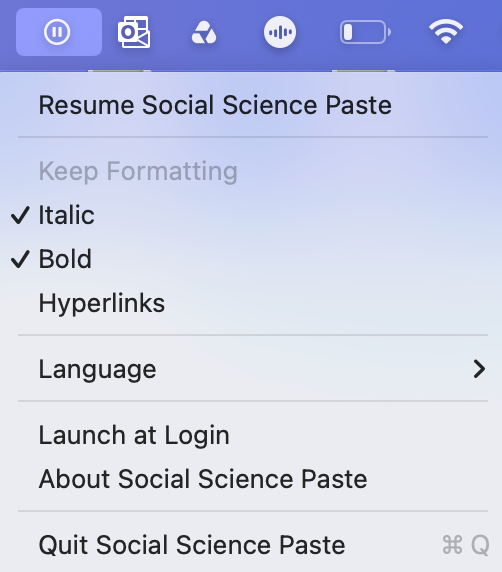
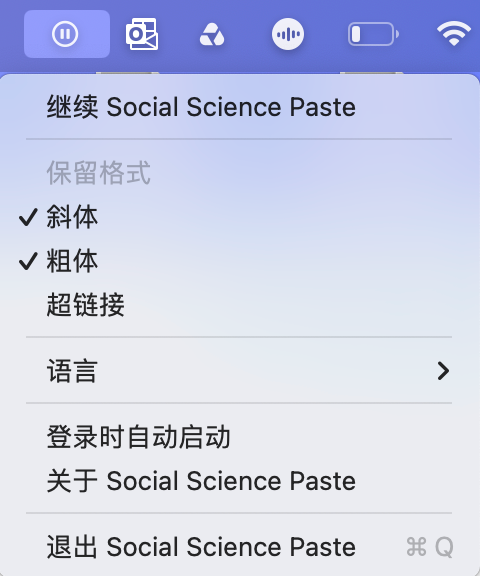

# Social Science Paste

<p align="center">
  
</p>

<p align="center"><strong>Selective clipboard cleaning for academic writing on macOS. / 面向学术写作的选择性剪贴板格式清理工具。</strong></p>

<p align="center">
  <a href="#english">English</a>
  ·
  <a href="#中文">中文</a>
</p>

<p align="center">
  <a href="https://github.com/warvantage/social-science-paste/releases/download/v1.0.0/Social-Science-Paste-1.0.0.dmg"><strong>v1.0.0 (Stable)</strong></a>
  ·
  <a href="https://github.com/warvantage/social-science-paste/releases/download/v1.0.1-beta/Social-Science-Paste-1.0.1-beta.dmg"><strong>v1.0.1-beta (Word Compatibility)</strong></a>
</p>

---

<a id="english"></a>
# English

**Social Science Paste is a lightweight macOS clipboard cleaner designed for academic writing.**

Normal paste often keeps too much: fonts, sizes, colours, highlighting, and other source styling. Plain-text paste removes too much: it can also remove *italics*, **bold emphasis**, and hyperlinks that still carry meaning in academic writing.

Social Science Paste lets you choose independently whether to preserve **Bold**, *Italic*, and <u>Hyperlinks</u> — in any combination — while removing unwanted presentation styling.

- **Bold** — on / off
- *Italic* — on / off
- <u>Hyperlinks</u> — on / off
- Pause / Resume — temporarily stop clipboard cleaning whenever you need the original copy untouched
- Launch at Login
- Language — interface currently available in English and Chinese
- Keep using the normal `⌘V` shortcut
- Clipboard processing stays on your Mac

## Why “Social Science Paste”? 

Academic writing constantly moves text between browsers, AI tools, Word documents, collaborative editors, slides, and email. The useful part of formatting is often semantic — an italicised book title, an emphasised phrase, or a citation link — while the copied font, size, colour, or highlighting is usually unwanted.

Social Science Paste grew out of that small but persistent problem. Its aim is simple:

> **Preserve meaning. Remove presentation.**

## How it works

Social Science Paste lives in the macOS menu bar and cleans copied text automatically.

<p align="center">
  
</p>

1. Copy text normally. Social Science Paste detects the new clipboard content and cleans it in the background.
2. Choose what to keep. **Bold**, *Italic*, and <u>Hyperlinks</u> are independent options and can be combined freely.
3. Paste normally with `⌘V`. The destination application keeps using its own native paste command.
4. Pause whenever needed. When paused, new clipboard content is left untouched; resume the app to continue cleaning future copies.

The screenshot above shows the English interface. The app is paused in this example, so the first menu item appears as **Resume Social Science Paste**.

## What it cleans

For supported text and rich-text clipboard content, Social Science Paste rebuilds a minimal cleaned clipboard representation rather than carrying across the source application's full styling payload.

| Content | Behaviour |
| --- | --- |
| Text content | Preserved |
| Line breaks / paragraphs | Preserved |
| Unicode text | Preserved |
| Bold | Optional |
| Italic | Optional |
| Hyperlinks | Optional |
| Source font / font size | Removed |
| Source colours / highlighting | Removed |
| Other source presentation styling | Removed |
| Unneeded source-specific clipboard metadata | Removed when processed text is rebuilt |
| Images / files / PDF objects | Left untouched |
| Structured tables | Currently left untouched |

## Downloads

### v1.0.0 (Stable)

General text and rich-text clipboard cleaning with independently selectable Bold, Italic, and Hyperlink preservation.

**[Download Social-Science-Paste-1.0.0.dmg](https://github.com/warvantage/social-science-paste/releases/download/v1.0.0/Social-Science-Paste-1.0.0.dmg)**

### v1.0.1-beta (Word Compatibility)

Includes additional compatibility improvements for text copied from Microsoft Word and Office applications.

**[Download Social-Science-Paste-1.0.1-beta.dmg](https://github.com/warvantage/social-science-paste/releases/download/v1.0.1-beta/Social-Science-Paste-1.0.1-beta.dmg)**

If you regularly work in Microsoft Word, the beta is the recommended version to try.

> The current builds are not notarised with an Apple Developer ID. If macOS blocks the first launch, go to **System Settings → Privacy & Security → Open Anyway**.

## Privacy

Clipboard processing is local. Social Science Paste does not upload clipboard contents to a server.

When Social Science Paste handles a text item, it rebuilds a cleaned clipboard representation instead of carrying forward unnecessary source styling and source-specific clipboard metadata. Non-text content outside the current scope is left untouched.

## Requirements

- Apple Silicon Mac (M1 or later)
- macOS 11 Big Sur or later

## Build from source

```bash
bash build-local.sh
```

## Feedback and contributions

Bug reports, compatibility feedback, and pull requests are welcome. If you encounter unexpected behaviour, please open a GitHub Issue and include the source application, destination application, and a short example of the copied content when possible.

---

<a id="中文"></a>
# 中文

**Social Science Paste 是一款面向学术写作场景的 macOS 轻量级剪贴板格式清理工具。**

普通粘贴往往会保留太多来源格式，例如字体、字号、颜色和高亮；而纯文本粘贴又经常删得太彻底，把论文写作中仍然有意义的 *斜体*、**粗体强调** 和超链接一起删除。

Social Science Paste 的核心区别是：你可以分别选择是否保留 **粗体**、*斜体* 和 <u>超链接</u>。三个选项彼此独立，可以任意组合。

- **粗体 Bold** — 开 / 关
- *斜体 Italic* — 开 / 关
- <u>超链接 Hyperlinks</u> — 开 / 关
- 暂停 / 恢复 — 需要暂时保留原始复制内容时，可以随时停止剪贴板清理
- 登录时自动启动
- 语言 — 界面目前提供中文和英文两种选择
- 继续使用正常的 `⌘V`
- 所有剪贴板处理都在本机完成

## 为什么使用 Social Science Paste？

社科学术写作经常需要在网页、AI 工具、Word、协作文档、PPT 和邮件之间移动文字。真正需要留下的往往是有意义的格式——例如书名斜体、强调和引用链接；而来源字体、字号、颜色和高亮通常只是视觉样式。

Social Science Paste 就来自这个很小、但非常反复出现的写作痛点：

> **保留意义，清理呈现。**

## 它是怎么工作的？

Social Science Paste 常驻在 macOS 菜单栏中，并在复制文字后自动处理剪贴板。

<p align="center">
  
</p>

1. 正常复制文字。Social Science Paste 会检测新的剪贴板内容，并在后台进行清理。
2. 选择需要保留的格式。**粗体**、*斜体* 和 <u>超链接</u> 三个选项彼此独立，可以任意组合。
3. 继续正常使用 `⌘V` 粘贴。目标软件仍然使用自己的原生粘贴命令。
4. 需要时随时暂停。暂停后，新的复制内容会保持原样；恢复后，只处理之后的新复制内容。

上面的截图展示中文界面。该截图拍摄时软件处于暂停状态，因此顶部显示为 **继续 Social Science Paste**。

## 会清理什么？

对于当前支持的文本和富文本内容，Social Science Paste 会重新构建一个尽量精简的剪贴板版本，而不是把来源软件完整的视觉样式一起带过去。

| 内容 | 处理方式 |
| --- | --- |
| 文字内容 | 保留 |
| 换行 / 段落结构 | 保留 |
| Unicode 文字 | 保留 |
| 粗体 | 可选保留 |
| 斜体 | 可选保留 |
| 超链接 | 可选保留 |
| 来源字体 / 字号 | 清除 |
| 来源颜色 / 高亮 | 清除 |
| 其他来源视觉样式 | 清除 |
| 不需要的来源剪贴板附加信息 | 重建文本剪贴板时清除 |
| 图片 / 文件 / PDF 对象 | 暂不处理，原样保留 |
| 结构化表格 | 暂不处理，原样保留 |

## 下载

### v1.0.0（Stable）

稳定基础版本，适用于一般文本和富文本剪贴板清理，并支持独立选择保留粗体、斜体和超链接。

**[下载 Social-Science-Paste-1.0.0.dmg](https://github.com/warvantage/social-science-paste/releases/download/v1.0.0/Social-Science-Paste-1.0.0.dmg)**

### v1.0.1-beta（Word Compatibility）

进一步增强了从 Microsoft Word 和 Office 应用复制文字时的兼容性。

**[下载 Social-Science-Paste-1.0.1-beta.dmg](https://github.com/warvantage/social-science-paste/releases/download/v1.0.1-beta/Social-Science-Paste-1.0.1-beta.dmg)**

如果你经常使用 Microsoft Word，建议优先尝试 Beta 版本。

> 当前版本尚未使用 Apple Developer ID 进行 notarisation。如果 macOS 第一次启动时阻止打开，请前往 **系统设置 → 隐私与安全性 → 仍要打开（Open Anyway）**。

## 隐私

所有剪贴板处理都在本机完成。Social Science Paste 不会把你的剪贴板内容上传到服务器。

在处理文本时，Social Science Paste 会重新构建清理后的剪贴板内容，而不是继续携带不需要的来源样式和剪贴板附加信息。当前范围之外的非文本内容则不会被修改。

## 系统要求

- Apple Silicon Mac（M1 或更新）
- macOS 11 Big Sur 或更新版本

## 从源码构建

```bash
bash build-local.sh
```

## 反馈与贡献

欢迎提交 Bug、兼容性反馈和 Pull Request。如果遇到异常，建议在 GitHub Issues 中说明复制来源、粘贴目标，以及一个简短的示例文本，这会更容易定位问题。

---

## Maintainer

Maintained by the Social Science Paste project.

## Licence

Source code in this repository is licensed under the Mozilla Public License 2.0 (MPL-2.0).
